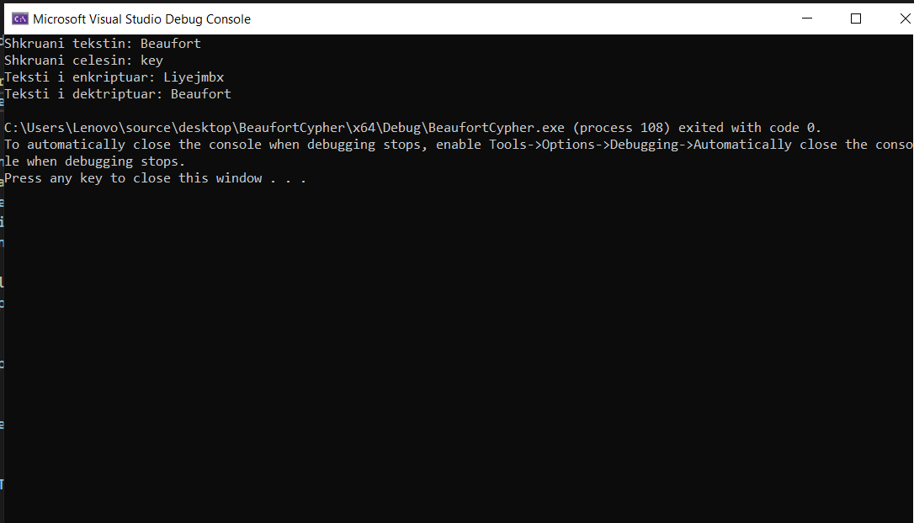

# Data Security - Project 2
## University of Prishtina - Faculty of Electrical and Computer Engineering

### Implementations of cryptographic algorithms: Diagonal Transposition Cipher and Beaufort Cipher.

#### Authors:
Mirgeta Gashi 
Natyra Bicaj 
Naila Radoncic 
Mesud Hoxha 

#### Programing language: Java, C++

### 1. Diagonal Transposition Cipher
#### Encryption:
1. Run program
2. Enter plaintext
3. Enter key
4. Display the encrypted text

#### Decryption:
1. Run program
2. Enter ciphertext
3. Enter key
4. Display the plain text

#### Description:
Diagonal transposition cipher enhanc the security and efficiency of transposition-based encryption. By arranging plaintext characters diagonally and utilizing variable-length matrices, the algorithm aims to streamline encryption processes and mitigate vulnerabilities.Diagonal transpositional also supports the space between the words. The algorithm which is used to arrange the input string into diagonal is as follows:
1. Write the plain text message in a diagonal form of variable length size:  diagonal, upper triangular, and lower triangular format
2. Generate the key
3. Read the message column by column in random order of columns by using the key positions with the help of wave technique
4. Reads from bottom to top 

#### Results:
 Encryption  

Decryption  

### 2.Beaufort Cipher

#### Encryption and Decryption
1.Run program
2.Enter plaintext
3.Enter key
4.Display the encrypted text
5.Display the plaintext

#### Description:
Beaufort Cipher is a method of encryption that uses a specific key to encode and decode messages. This method works by comparing each letter of the message with the corresponding letter of the key and using a type of operation called "modulo subtraction" to find the encoded letter. For example, if the message letter is "A" and the key letter is "C", the encoded letter will be "Y". This process is repeated for each character in the message to encode the entire message. To decode, the operations are reversed. Beaufort Cipher provides a simple and effective method for ensuring communication. 

#### Results:
Encryption and decryption  

